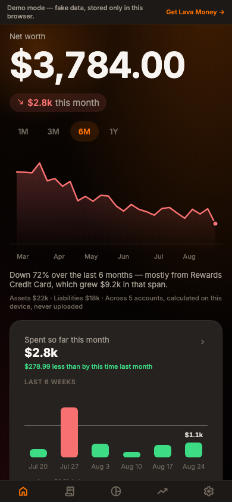
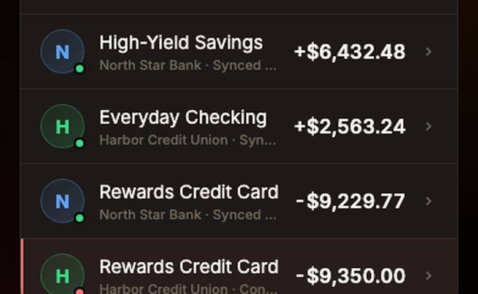
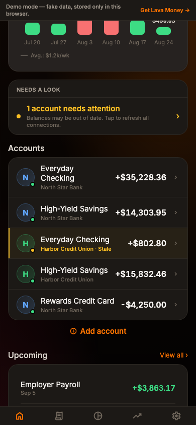
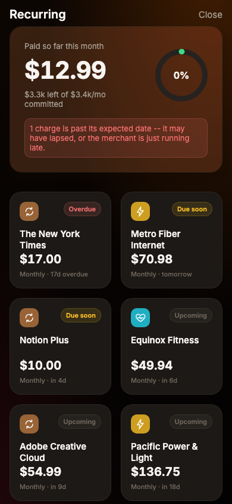
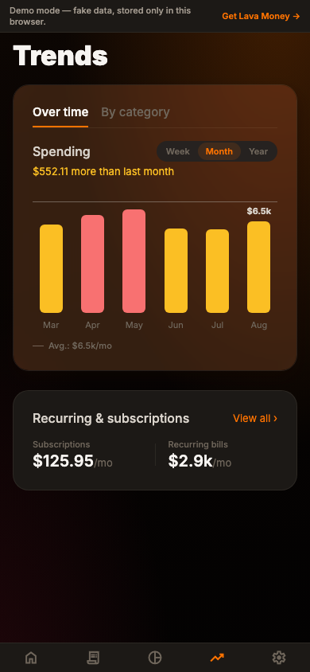
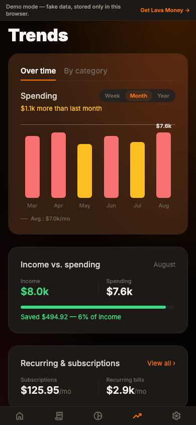
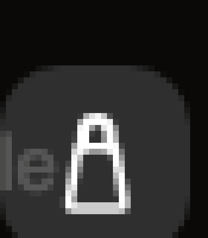

# Design audit: closing the gap with Copilot/Apple/Vercel

Overnight design pass, framed as an outside UI/UX consultant's review: where is
Lava Money still inferior to Copilot (our primary reference), or just
objectively cluttered/misaligned/hard-to-read on its own terms, independent of
any competitor comparison. Everything below was found by actually clicking
through the running app (Playwright driving the web build at real phone
viewport size, 390×844) and reading the source for the screens Playwright
can't reach (native-only Plaid linking, onboarding on web — see "What
Playwright can't see" at the bottom) — not a re-read of old screenshots or a
guess from memory.

Two things are combined in one doc rather than split into "findings" and
"plan": most of what's below was fixed the same night it was found, so a
findings doc and a plan doc would have been the same document twice, one of
them already stale. Where something was *not* fixed tonight, it's called out
explicitly under "Not done tonight."

## Severity key

- 🔴 **Trust bug** — the app tells the user something false or self-contradictory
- 🟠 **Usability bug** — information is lost, unreadable, or actively confusing
- 🟡 **Polish gap** — works, but reads as unfinished/generic next to Copilot

---

## 🔴 Net worth insight sentence could contradict itself

**Where:** Home hero, `components/home/NetWorthHero.tsx` (shared by the
mobile tab and the desktop dashboard — same component, one fix covers both).

**What was wrong:** The one-sentence "why did net worth move" caption below
the chart ("Up 11% over the last 6 months — mostly from Everyday Checking,
which grew $13k in that span") picks whichever single account moved by the
largest dollar amount, in *either* direction, then describes it with its own
"grew"/"fell" verb based on *that account's own* delta sign — with no check
that the account's direction actually matched the headline's direction. Live
example caught mid-audit:

> Down 21% over the last 6 months — mostly from Everyday Checking, which
> **grew** $9.5k in that span.

Net worth down, "explained" by an account that grew. That's not a rare edge
case — it happens any time the single biggest *individual* swing points one
way while other accounts combined outweigh it the other way, which random
mock data hits constantly and real multi-account households will too. This
is the kind of self-contradiction that makes someone stop trusting every
other number in the app, not just this sentence.

A second, subtler version of the same bug: for a **liability** account
(credit card), "grew"/"fell" was worded off the *net-worth-contribution*
delta (`-balance`), not the account's own balance. A credit card whose debt
*grew* $6k has a contribution that *fell* — so the old code would say
"Rewards Credit Card, which **fell** $6k" to describe debt going *up*,
backwards from how anyone reads "the card fell."

**Fix:** `lib/utils/netWorth.ts`'s `biggestNetWorthMover()` now takes an
optional `directionFilter: 'up' | 'down'` and only considers accounts whose
own contribution-delta shares that sign — there's always at least one
(arithmetically, if the total fell, at least one account's delta must have
been negative). `NetWorthHero.tsx` passes the headline's own direction as
that filter, and separately flips the grew/fell verb for liability accounts
so it describes the balance a reader actually sees on that account, not the
internal contribution sign. Re-rolled the demo data across more than a dozen
fresh random seeds (the web build regenerates mock data per session) looking
for contradictions post-fix — none found, including the exact
harder case this fix targets, a falling-net-worth month correctly pinned on
a credit card whose *debt* grew:

---

## 🔴 "Free to spend" language (explicit ask)

**Where:** Budgets tab hero, `components/budgets/BudgetHero.tsx`.

**What was wrong:** Flagged directly by Drew — "what does 'Free to spend'
even mean." Ambiguous: free *relative to what*, and it doesn't distinguish
"under budget" from "no budget set at all."

**Fix:** Already shipped earlier this session, confirmed still in place —
`heroLabel` is `'Spent this month'` (no budgets set), `'Over budget'`, or
`'Left to spend'` (under budget), matching Copilot's own three-state
language for this exact card.

---

## 🟠 Home account rows: sync-status text truncating into gibberish

**Where:** Home tab accounts list, `app/(tabs)/index.tsx`'s `AccountRow`.

**What was wrong:** Each row's subtitle used to be
`{institution name} · {full sync label} · {credit limit}`, e.g. "Harbor
Credit Union · Connection issue · synced 3d ago · $9.0k limit" — all on one
`numberOfLines={1}` line. A real institution name alone (**"Harbor Credit
Union"**, 19 characters) already eats nearly the entire available row width
at this font size; anything appended after it never had room and rendered as
truncated, meaningless fragments:

The credit-limit suffix, positioned last, *never* rendered at all in
practice — it always lost the truncation race to the sync label in front of
it.

**Fix:** The pulsing green dot on the account avatar already *is* the
"synced and healthy" signal (see `presentSyncStatus().pulse`) — a healthy
row now shows just the institution name, nothing else. Only accounts that
actually `needsAttention()` (stale/error) get a short single-word suffix
("Stale" / "Error") appended, color-matched to the existing accent bar and
tinted row background those states already get — and the subtitle line got
`numberOfLines={2}` instead of `1` so that rarer, more important case can
wrap instead of truncate, without growing every row's height for the common
case. Credit limit dropped from this specific list entirely — it's already
shown prominently on the account detail page, and never actually rendered
here before this fix anyway.

After — institution name alone for healthy rows, a concise wrapped "Stale"
suffix (orange accent bar + tint) only where it's actually needed:

*Self-caught regression while fixing this:* first pass also added
`numberOfLines={1}` to the account *name* itself (not just the subtitle),
which truncated names like "Everyday Checking" mid-word instead of letting
them wrap to a second line the way they always had. Reverted — the name
should never truncate, only the subtitle.

---

## 🟠 "Late"/"Overdue" recurring status was unreachable and unverified

**Where:** Mock data generator, `lib/mock/generator.ts`.

**What was wrong:** Earlier this session, `lib/utils/insights.ts` got a new
`'late'` status (distinct from `'overdue'`) specifically so a charge one day
past due doesn't get the same forward-looking "Due soon" badge as one
genuinely five days out. Good fix — except the mock generator's recurring-
bill loop (`while (cursor < new Date())`) always walks every template
forward right up to the present, so *every* generated series' most recent
occurrence was, by construction, never more than one cadence period old.
`detectRecurringSeries()` could mathematically never classify anything as
`'late'` or `'overdue'` from generated data. That status/color/copy path was
completely unverified by clicking through the demo, and invisible to anyone
screenshotting the app for the App Store — including Drew, who asked about
exactly this "Free to spend"-style unclear-copy risk in the same message
that kicked off this audit.

**Fix:** Exactly one subscription template per linked institution (never
rent/payroll/utilities — a lapsed paycheck reads as a crisis, a lapsed
streaming subscription reads as an ordinary Tuesday) now has ~60% odds of
skipping its single most-recent expected occurrence, simulating a cancelled-
but-not-yet-noticed subscription. Realistic on its own merits, and it makes
the late/overdue path demonstrable:

Verified the banner text, the red "Overdue" badge, and the "17d overdue"
caption underneath are now all in the same tense — confirming the `'late'`
vs `'overdue'` fix from earlier actually works, not just that it typechecks.

---

## 🟡 Trends "Over time" tab ends in a wall of empty black space

**Where:** `app/(tabs)/trends.tsx`.

**What was wrong:** The tab's first view (Over time: chart + a two-number
Recurring teaser card) left a few hundred px of plain background before the
tab bar on a standard phone height — not broken, just visibly unfinished
next to how much Copilot's own trends screen packs into the same vertical
space. A pure spend-over-time chart also can't answer "is this spending
level actually fine" without knowing what came in against it.

**Fix:** New `components/trends/CashFlowCard.tsx` — "Income vs. spending"
for the last *complete* month (same `completeOnly` convention as
`BudgetBreakdownCard` and the hero chart itself, so it doesn't read as
"saving a lot" for the first three weeks of a new month before most bills
land), income/spending side by side, and a thin progress bar (filled =
spend/income ratio, green when under 100%, red over) plus a one-line "Saved
$X — Y% of income" / "Spent $X more than you earned" summary. Every number
it needs already existed via the pre-existing `useMonthlyIncomeVsExpense`
hook — this was a missing *view*, not missing data.

Before / after:

---

## 🟡 "Shopping" category glyph read as a padlock, not a bag

**Where:** `components/ui/CategoryGlyph.tsx` / `CategoryIcon.tsx`.

**What was wrong:** Earlier this session, `transport`'s car icon got fixed
(wheels were sitting on the body's own baseline, invisible at real tile
size — now bigger and pulled below a shortened body). `shopping`'s bag got a
first-pass fix too (thickened handle stroke). Swatch-testing that fix at the
glyph's *actual* rendered size (~18–19px in the default `CategoryIcon` tile)
showed it wasn't enough — and confirmed something more fundamental: **any**
"rounded arc sitting on top of a rectangle" silhouette reads as a padlock at
this size, no matter how the taper or handle width gets tuned, because that
exact shape is such a strong, common pattern elsewhere (including this app's
own privacy/lock icon) that proportion tweaks can't out-compete it:

| Current (round 1 fix) | Bigger taper | Taller handle | Two loops |
|---|---|---|---|
|  |  |  |  |

**Fix:** Replaced the bag metaphor entirely with a price tag (pointed
vertex, flat shoulder, offset hole) — a genuinely different silhouette that
can't be mistaken for a shackle-over-a-body, and arguably fits this
category's actual contents (Amazon, Target, IKEA, Best Buy — general retail,
not specifically clothing) better than a literal bag would:

Re-confirmed rendering at actual `CategoryIcon` tile size in the live app
(not just the isolated HTML test harness used to iterate through the options
above):

---

## Already fixed earlier this session (context, not new tonight)

Carried forward from the audit-and-fix work done before this document, so
the state of things above makes sense in context. Not re-litigated in detail
here:

- **Category color collisions** — subscriptions/utilities and
  entertainment/dining/travel were sharing near-identical hues once actually
  swatch-rendered as filled circles (hue-degree math alone didn't catch it).
  Added `brown`/`rose` to the palette, reassigned subscriptions → brown,
  travel → indigo, entertainment → rose.
- **Chart reference-line mismatch** — Home's `SpendingCard` and Trends'
  `SpendingHeroCard` were comparing total weekly/monthly spend against a
  summed per-category *budget* (which excludes rent, travel, anything
  un-budgeted), reading as "over budget" most weeks regardless of actual
  spending pace. Both now use a trailing average of what's actually plotted.
- **SpendingCard headline/chart mismatch** — a month-to-date "$0.00" headline
  sat directly above a chart of the last 6 *complete* weeks (deliberately
  excluding the partial current week) with nothing explaining the
  discrepancy. Added a "Last 6 weeks" caption above the chart.
- **Privacy overclaims** — "stored only on this device, never uploaded" was
  true for the web demo but not for native once Plaid is linked (an
  encrypted token does reach a server). Settings, the Home net-worth
  footnote, onboarding, and the add-account chooser are now all
  platform/context-conditional instead of repeating the stronger claim
  everywhere.
- **Stale "Upcoming" items** — `useUpcomingRecurring` could surface a series
  whose `nextExpectedDate` had already passed, under a section literally
  titled "Upcoming." Now filtered to `nextExpectedDate >= today`.
- **Transaction detail dead space** — a short detail view left the bottom
  half of the screen solid black. Added "More from [Merchant]" — recent
  transactions at the same merchant plus a frequency/average summary, using
  data the screen already had loaded.

## Confirmed working well (no change needed)

Spot-checked against the "Robinhood/Brex" feedback from earlier in the
project — all still holding up:

- Net worth and account-detail balances render **uncontained**, full-bleed
  against the screen with a full-width gradient chart, not boxed in a card.
- The credit card account view renders an actual **card visual** (bank name,
  masked digits, card network mark) above the balance, not just a number.
- `late`/`overdue`/`due_soon` recurring badges, once actually reachable (see
  above), render internally consistent — badge color, badge text, and the
  "Nd overdue" caption all agree with each other now.

## Not done tonight (flagged for follow-up, not forgotten)

- **`BudgetBreakdownCard`'s "Spending by category" caps at 6 rows** with no
  "view all" — if more than 6 categories had spend, the rest are simply not
  visible from Budgets (Trends' own "By category" view does show all of
  them, so the data isn't lost app-wide, just from this one card). Small,
  deliberately deferred rather than rushed.
- **Onboarding (`screens/OnboardingFlow.tsx`) and `AddAccountChooser.tsx`**
  were reviewed by reading the source, not by clicking through them — the
  web build intentionally skips onboarding entirely and always auto-seeds
  two demo institutions (`app/_layout.tsx`: *"Web only ever exists as the
  public, no-signup browser demo... there is no one to show onboarding
  to"*), so there is no way to reach this flow through the web preview
  Playwright drives. Both read clean on review; worth an actual TestFlight
  click-through to confirm, since that's the one path this audit couldn't
  visually verify.
- **Desktop/web layouts** (`components/web/Desktop*.tsx`) were only
  spot-checked, not audited with the same depth as mobile — this pass was
  scoped to "the mobile app" per the request that kicked it off. `NetWorthHero`
  is shared code so its fix applies to both automatically; the rest of the
  desktop-specific layouts weren't re-reviewed tonight.
- **`transfer` and `subscriptions` glyphs** are recognizable but more
  abstract than the others (crossed arrows; circular refresh arrows) —
  functional, not misread as anything else, just not as immediately
  "obvious" as income's arrow-into-a-tray or housing's roofline. Left alone;
  flagging in case a future pass wants to revisit.

## What Playwright can't see

This audit's screenshots all come from driving the Expo **web** build
(`localhost:8081`) with Playwright at a 390×844 viewport, because that's
what's actually scriptable headlessly. Two real gaps that leaves:

1. **Real Plaid linking** only exists on native (iOS/Android) —
   `usePlaidLink.web.ts` is a stub. Nothing about the actual Plaid Link SDK
   flow, its native modal presentation, or its error states was visually
   re-verified tonight.
2. **Onboarding** is native-only by design (see above) — its actual on-
   device appearance (safe-area insets, real iOS animations, haptics) wasn't
   screenshotted, only read as source.

Both are reasonable candidates for a manual TestFlight pass rather than more
scripting — trying to fake a native Plaid Link session or force onboarding
into the web build would be testing something other than the real thing.
